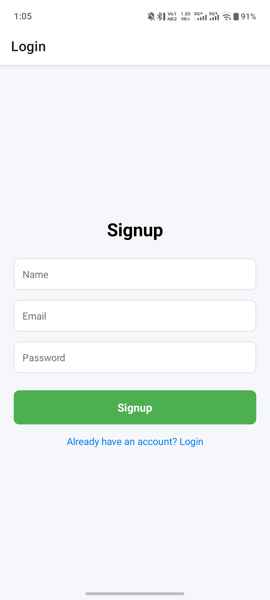
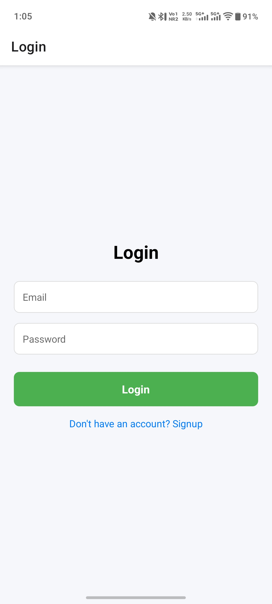
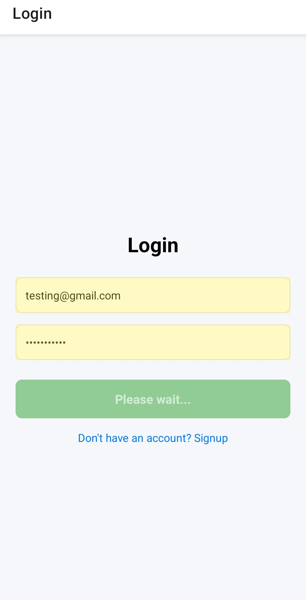
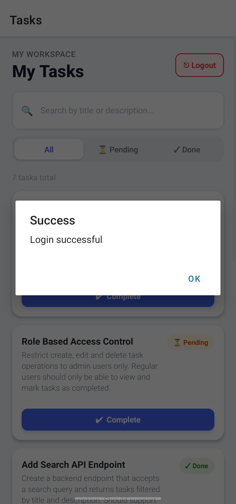
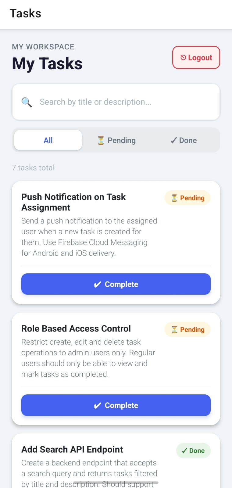
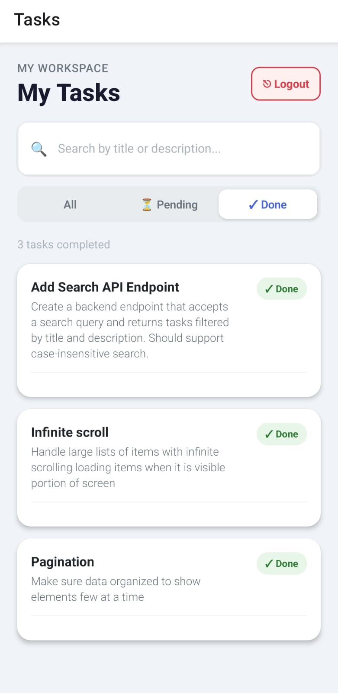
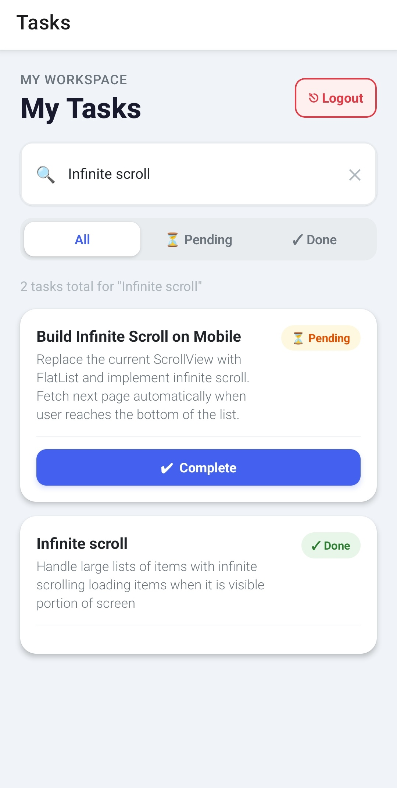
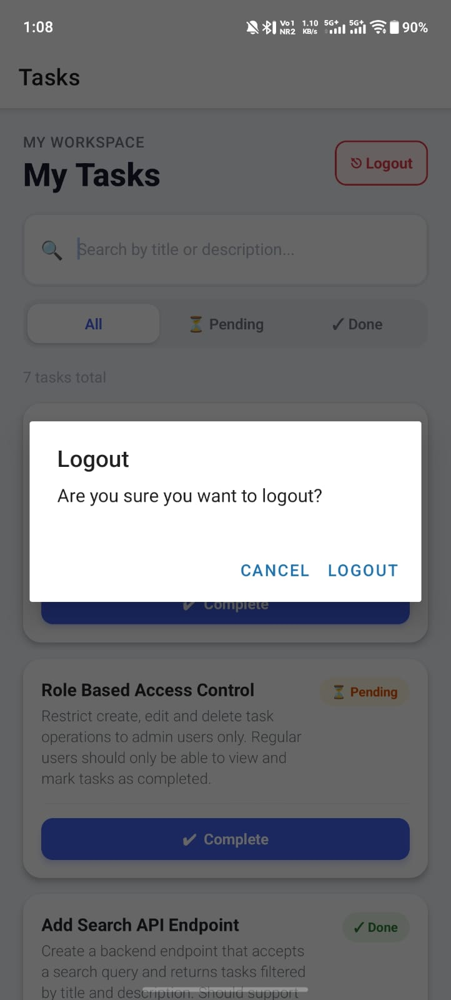

# 🚀 Task Manager App (Full Stack)

A **role-based task management mobile application** built using **React Native (Expo)** for the frontend and **Node.js, Express, MongoDB** for the backend.

This project demonstrates **full-stack development**, including authentication, API design, role-based access control, and mobile UI integration.

---

## 🎯 Assignment Coverage

This project fulfills all required criteria:

* ✔ Full-stack development (React Native + Node.js)
* ✔ API design and integration
* ✔ Authentication and role-based authorization
* ✔ Data modeling using MongoDB
* ✔ Clean UI with loading, empty, and error states

---

## 📱 Features

### 🔐 Authentication

* User Signup & Login
* JWT-based authentication
* Secure password hashing (bcrypt)

---

### 👥 Role-Based Access

#### Admin

* Create tasks
* Assign tasks to users
* View all tasks
* Edit tasks
* Delete tasks

#### User

* View assigned tasks only
* Update task status (Pending → Completed)

---

### 📋 Task Management

* Full CRUD operations
* Status tracking (Pending / Completed)
* Role + ownership validation

---

### 🔍 Additional Features

#### Task Filtering

* Filter tasks based on status: **Pending / Completed**
* Implemented using client-side state filtering
* Instant updates without extra API calls

#### Search Functionality

* Search tasks by title (case-insensitive)
* Real-time filtering as user types
* Smooth and responsive UX

---

## 🧠 UI & UX Handling

* Loading indicators during API calls
* Empty state when no tasks are available
* Alert messages for success and error states
* Card-based UI with badges and actions

---

## 💾 Data Persistence

* Tasks stored in MongoDB
* JWT token stored using AsyncStorage
* User session persists after app restart

---

## ⚠️ Error Handling

* Centralized error handling using custom `AppError`
* Graceful error messages on UI
* Input validation for API requests

---

## 🏗️ Tech Stack

### Frontend (Mobile)

* React Native (Expo)
* Axios
* AsyncStorage
* React Navigation

### Backend

* Node.js
* Express.js
* MongoDB + Mongoose
* JWT Authentication

---

## 📂 Project Structure

```txt
TaskManager/
├── backend/
│   ├── modules/
│   ├── middlewares/
│   ├── utils/
│   ├── config/
│   └── server.js
│
├── mobile/
│   ├── src/
│   │   ├── screens/
│   │   ├── services/
│   │   └── utils/
│   └── App.js
```

---

## ⚙️ Setup Instructions

### 🔧 Backend Setup

```bash
cd backend
npm install
```

Create `.env`:

```env
PORT=5000
MONGO_URI=your_mongodb_connection
JWT_SECRET=your_secret
```

Run server:

```bash
npm run dev
```

---

### 📱 Frontend Setup

```bash
cd mobile
npm install
npm start
```

Update API base URL:

```js
mobile/src/services/api.js
```

Example:

```js
baseURL: "http://YOUR_LOCAL_IP:5000/api"
```

---

## 🔌 API Endpoints

### Auth

* `POST /api/auth/signup`
* `POST /api/auth/login`

### Tasks

* `GET /api/tasks` → Role-based fetch
* `POST /api/tasks` → Admin only
* `PUT /api/tasks/:id/status` → Update status
* `PUT /api/tasks/:id` → Admin only
* `DELETE /api/tasks/:id` → Admin only

---

## 🔐 Security Highlights

* JWT-based authentication
* Role-based authorization (Admin/User)
* Ownership validation for task updates
* Environment variables for sensitive data

---

## 📊 Evaluation Criteria Covered

* ✔ End-to-end functionality (frontend + backend working)
* ✔ Correct role-based access implementation
* ✔ Clean API design and structure
* ✔ Modular and readable code
* ✔ Proper async handling
* ✔ Graceful error handling
* ✔ Clear and usable UI
* ✔ Extra features (Edit/Delete, Filtering, Search)

---

## 📸 App Screenshots

### 🔐 Authentication Flow
<p>
  
  
  
  
</p>

### 📋 Task Management
<p>
  
  
  
  
</p>

---

## 🚀 Future Improvements

* Backend-based filtering and search
* Pagination for large datasets
* Notifications
* UI animations and enhancements
* Admin dashboard (web)

---

## 👨‍💻 Author

Hemanth Kumar

---

## ⭐ If you like this project

Give it a ⭐ on GitHub!
